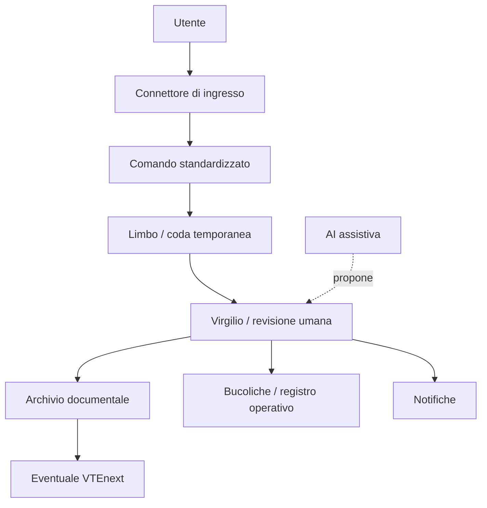

# Architettura e roadmap

Questo documento descrive l'architettura attuale di Virgilio e la direzione modulare da discutere prima di ogni sviluppo ulteriore.

## Architettura attuale

La v1.0 e' un MVP Google Workspace mono-utente.

| Livello | Implementazione attuale | Note |
|---|---|---|
| Interfaccia utente | `virgilio.html` servito da `webapp.gs` | Form guidato per apertura pratica |
| Automazione | Apps Script | Logica principale nel componente Caronte |
| Posta | Gmail personale via `GmailApp` | Mono-utente, contesto dell'esecutore |
| Coda temporanea | Limbo su Google Drive | Deposito allegati non ancora assegnati |
| Archivio documentale | Google Drive / Empireo | Struttura cliente, sito, pratica |
| Registro | Bucoliche su Google Sheets | Registro operativo, non database definitivo |
| Notifiche | Google Chat e Telegram | Canali del prototipo |

Flusso sintetico:

```text
Email Gmail o form Virgilio
  -> Apps Script
  -> Limbo / Drive
  -> Bucoliche
  -> Chat / Telegram
```

## Architettura target modulare

La direzione target non deve assumere che Google Workspace sia il vincolo definitivo. Il modello da valutare e':

```text
UTENTE
  -> connettore di ingresso
  -> comando standardizzato Caronte
  -> Limbo controllato
  -> Virgilio
  -> archivio documentale definitivo
  -> eventuale VTEnext
```



## Livelli del sistema

1. **Interfaccia utente**: form, upload manuale, eventuali viste future.
2. **Connettori**: Gmail, Outlook, Workspace Studio, Power Automate, upload manuale.
3. **Coda / Limbo**: area temporanea controllata, con regole di conservazione e verifica.
4. **Nucleo Caronte**: comandi deterministici per cartelle, registro, notifiche.
5. **Archivio documentale**: Drive, Shared Drive, SharePoint o altra scelta futura.
6. **CRM**: VTEnext solo dopo chiarimento del flusso operativo.
7. **AI**: supporto progressivo, sempre con revisione umana.

## Roadmap

### Fase 0 - Consolidamento

| Voce | Contenuto |
|---|---|
| Obiettivo | Congelare v1.0 e rendere il progetto leggibile |
| Prerequisiti | Repository Git, tag v1.0, documentazione minima |
| Output atteso | README, changelog, roadmap, rischi documentati |
| Criteri di completamento | Nessun nuovo sviluppo, test manuali verificati |
| Rischi | Confondere prototipo con sistema produttivo |
| Decisioni necessarie | Chi approva il passaggio alla fase successiva |

Attivita':

- congelare v1.0;
- verificare test;
- documentare limiti;
- introdurre changelog;
- nessun nuovo sviluppo.

### Fase 1 - Modularizzazione minima

| Voce | Contenuto |
|---|---|
| Obiettivo | Separare ingresso email dal nucleo operativo |
| Prerequisiti | Formato comando di ingresso definito |
| Output atteso | Contratto dati stabile e fallback manuale |
| Criteri di completamento | Stesso comportamento v1.0, minore dipendenza dal client posta |
| Rischi | Refactoring prematuro o perdita di tracciabilita' |
| Decisioni necessarie | Quale parte resta in Apps Script |

Attivita':

- separare ingresso Gmail dal nucleo Caronte;
- definire formato standard del comando di ingresso;
- mantenere fallback manuale;
- migliorare log;
- migliorare gestione allegati;
- mantenere revisione umana.

### Fase 2 - Ricognizione infrastrutturale

| Voce | Contenuto |
|---|---|
| Obiettivo | Capire l'ambiente reale prima di scegliere tecnologia |
| Prerequisiti | Riunione con utenti e responsabili |
| Output atteso | Scheda infrastruttura compilata |
| Criteri di completamento | Decisioni aperte aggiornate |
| Rischi | Scegliere connettori senza conoscere vincoli reali |
| Decisioni necessarie | Google, Microsoft o architettura ibrida |

Ambiti:

- Google Workspace;
- Microsoft 365;
- client email;
- dispositivi;
- archivio condiviso;
- permessi;
- backup;
- stato VTEnext;
- responsabilita' manutenzione.

### Fase 3 - Pilota multi-utente

| Voce | Contenuto |
|---|---|
| Obiettivo | Provare il flusso con 2-3 utenti |
| Prerequisiti | Permessi e test sicurezza minimi |
| Output atteso | Misure d'uso, errori, casi non previsti |
| Criteri di completamento | Pilota concluso senza perdita documentale |
| Rischi | Allegati malevoli, permessi errati, duplicazioni |
| Decisioni necessarie | Criteri di estensione al resto del team |

Vincoli:

- 2-3 utenti;
- 1 sola tipologia di pratica;
- 1 solo archivio condiviso;
- nessuna AI su documenti riservati;
- metriche di utilizzo.

### Fase 4 - Connettori

| Voce | Contenuto |
|---|---|
| Obiettivo | Scegliere una strategia di ingresso sostenibile |
| Prerequisiti | Ricognizione completata |
| Output atteso | Connettore pilota scelto |
| Criteri di completamento | Decisione motivata e reversibile |
| Rischi | Lock-in, complessita' eccessiva, costi nascosti |
| Decisioni necessarie | Strategia multi-mailbox |

Opzioni da valutare:

- Workspace Studio Flow;
- trigger Apps Script personali;
- Gmail API + Domain-Wide Delegation;
- Power Automate;
- Microsoft Graph;
- upload manuale.

### Fase 5 - AI mirata

| Voce | Contenuto |
|---|---|
| Obiettivo | Introdurre un agente alla volta |
| Prerequisiti | Privacy, costi, test e revisione umana definiti |
| Output atteso | Primo caso AI controllato |
| Criteri di completamento | Accuratezza misurata, rollback possibile |
| Rischi | Dati riservati, costi API, affidamento improprio |
| Decisioni necessarie | Provider AI e categorie dati ammesse |

Agenti previsti:

| Nome | Funzione | Input | Output | Rischio | Revisione umana | Priorita' |
|---|---|---|---|---|---|---|
| Minosse | Classificatore | Email, metadati, allegati selezionati | Cliente, sito, tipo pratica suggeriti | Alto | Obbligatoria | Media |
| Dante | Ghostwriter | Dati pratica e contesto | Bozze email o note | Medio | Obbligatoria | Bassa |
| Ulisse | Estrattore dati | Documenti tecnici | Dati strutturati | Alto | Obbligatoria | Media |
| Cerbero | Guardiano scadenze | Registro e date | Avvisi scadenze | Medio | Necessaria per azioni | Media |
| Lettore documentale | Da definire | Documenti | Sintesi e riferimenti | Alto | Obbligatoria | Bassa |
| Radar normativo | Da definire | Fonti normative | Segnalazioni | Medio | Obbligatoria | Bassa |
| Beatrice | Amministrazione futura | Dati economici | Supporto fatture/pagamenti | Alto | Obbligatoria | Futura |

Principi AI:

- niente autonomia decisionale su attivita' critiche;
- niente invio automatico senza validazione;
- niente archiviazione automatica senza controllo;
- test iniziali solo su dati fittizi o anonimizzati;
- misurazione costi API;
- logging delle proposte AI;
- possibilita' di rollback.
