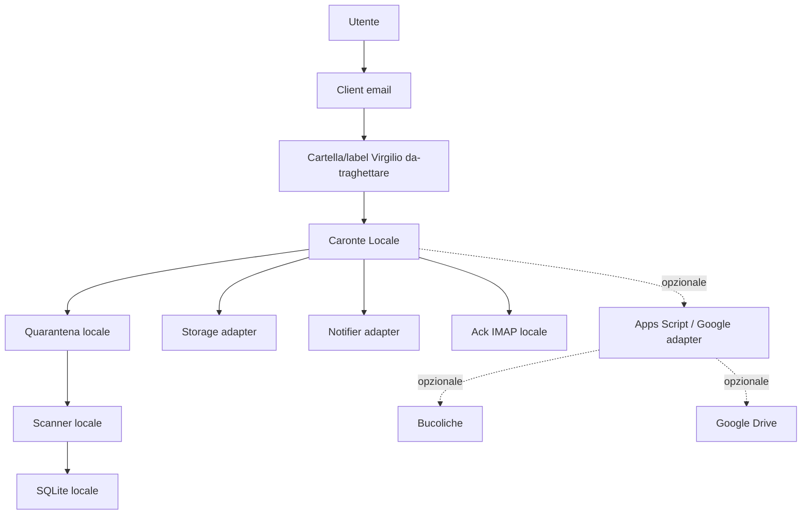

# Architettura e roadmap

Questo documento descrive l'architettura di Virgilio e la direzione di sviluppo aggiornata dopo i test sul connettore locale.

## Revisione 2026-06-26

Gli ultimi sviluppi hanno chiarito un punto decisivo: il multi-casella non deve essere costruito intorno ad Apps Script/GmailApp. `GmailApp` resta utile nel prototipo Google, ma opera solo nel contesto della casella dell'account esecutore.

La linea v1.1 deve quindi evolvere verso **Caronte Locale**:

```text
Virgilio = interfaccia, guida, supervisione
Caronte Locale = motore operativo locale multi-casella
Apps Script = adapter Google opzionale
```

## Architettura v1.0

La v1.0 e' un MVP Google Workspace mono-utente.

| Livello | Implementazione v1.0 | Note |
|---|---|---|
| Interfaccia utente | `virgilio.html` servito da `webapp.gs` | Form guidato |
| Automazione | Apps Script | Logica principale nel componente Caronte |
| Posta | Gmail via `GmailApp` | Mono-utente, contesto dell'esecutore |
| Coda temporanea | Limbo su Google Drive | Deposito allegati non ancora assegnati |
| Archivio documentale | Google Drive / Empireo | Struttura cliente, sito, pratica |
| Registro | Bucoliche su Google Sheets | Registro operativo, non database definitivo |
| Notifiche | Google Chat e Telegram | Canali del prototipo |

Flusso sintetico:

```text
Email Gmail o form Virgilio
  -> Apps Script
  -> Limbo / Drive
  -> Bucoliche
  -> Chat / Telegram
```

La v1.0 resta funzionante come prototipo, ma non va estesa in modo ingenuo al multi-utente.

## Sviluppi locali gia' realizzati

La linea sperimentale ha gia' validato molti pezzi utili:

| Area | Stato | Nota |
|---|---|---|
| IMAP read-only | Fatto | Lettura senza modificare la casella |
| `BODY.PEEK` | Fatto | Evita marcatura automatica come letta |
| Quarantena locale | Fatto | Allegati salvati localmente prima del passaggio successivo |
| Scanner locale opzionale | Fatto | Windows Defender integrato; ClamAV predisponibile |
| SQLite locale | Fatto | Stato e tracciamento locale |
| Manifest JSON | Fatto | Metadati standard per allegato |
| Staging Drive Desktop | Fatto | Copia controllata in cartella sincronizzata |
| Verifica cloud read-only | Fatto | Apps Script verifica presenza file/manifest senza prenderli in carico |
| Intake test | Fatto | Scrittura su tab `Staging_Local_Test` |
| P4 GmailApp | Fatto solo sul contesto esecutore | Confermato il limite multi-casella di Apps Script |

Questi blocchi vanno consolidati, non riscritti.

## Architettura target v1.1 local-first

La direzione aggiornata e':

```text
Utente
  -> client email esistente
  -> label/cartella Virgilio/da-traghettare
  -> Caronte Locale
      -> lettura IMAP multi-account
      -> quarantena locale
      -> scansione allegati
      -> manifest JSON
      -> SQLite locale
      -> storage adapter
      -> notifier adapter
      -> ack IMAP locale
  -> eventuali adapter Google / Bucoliche / Drive
```



## Ruoli aggiornati

| Componente | Ruolo aggiornato |
|---|---|
| Virgilio | Interfaccia, guida, supervisione e punto di coordinamento |
| Caronte Locale | Motore operativo locale, multi-casella e provider-agnostico |
| Apps Script | Adapter Google opzionale, utile per Drive, Sheets o compatibilita' v1.0 |
| Bucoliche | Registro ispezionabile/output adapter, non database primario |
| SQLite | Registro operativo primario locale |
| Drive Desktop | Storage adapter iniziale e reversibile |
| AI | Funzione futura, non necessaria per il pilota v1.1 |

## Roadmap aggiornata

### Fase A - Consolidamento

Obiettivo: portare su `codex/v1.1-development` solo i blocchi stabili, riducendo rami e documenti duplicati.

Output minimo:

- README aggiornato;
- roadmap aggiornata;
- decisioni architetturali chiare;
- test locali ripetibili;
- branch sperimentali candidate a eliminazione documentate.

### Fase B - Multi-account IMAP locale

Obiettivo: configurare piu' caselle IMAP in Caronte Locale.

Requisiti:

- `account_alias` obbligatorio;
- nessuna credenziale nel repository;
- errore su una casella non deve bloccare le altre;
- scan read-only iniziale;
- log separati per account.

### Fase C - Quarantena e staging per account

Obiettivo: evitare commistioni tra caselle.

Requisiti:

- `account_alias` in ogni record SQLite;
- `account_alias` in ogni manifest;
- percorsi locali separati o namespace separati;
- idempotenza su `attachment_id` e `sha256`.

### Fase D - Ack IMAP locale

Obiettivo: chiudere la mail nella stessa casella da cui e' stata letta.

Regola:

```text
ack solo dopo presa in carico riuscita,
stato locale coerente,
file gestito,
registro aggiornato.
```

Apps Script/GmailApp non deve piu' essere il meccanismo principale di ack multi-casella.

### Fase E - Registro SQLite e Bucoliche adapter

Obiettivo: SQLite diventa fonte primaria locale; Bucoliche resta un output adapter opzionale.

Requisiti:

- stato operativo persistente;
- idempotenza;
- export/sync verso Bucoliche solo se configurato;
- nessun blocco del flusso locale se Bucoliche non e' disponibile.

### Fase F - Storage adapter cartelle pratica

Obiettivo: spostare/copiare file verso una destinazione documentale configurabile.

Opzioni:

- filesystem locale;
- cartella server;
- Drive Desktop;
- OneDrive/SharePoint sincronizzato;
- futuro rclone/API.

### Fase G - Notifiche adapter

Obiettivo: isolare le notifiche dal nucleo operativo.

Canali possibili:

- console/log;
- Telegram;
- Google Chat;
- email;
- futuro CRM.

Le notifiche non devono essere la fonte primaria dello stato.

### Fase H - Pilota 2 utenti

Obiettivo: testare il flusso con due caselle reali e dati non critici.

Criteri minimi:

- due account IMAP configurati;
- una mail di prova per casella;
- allegati innocui;
- registro SQLite coerente;
- ack locale verificato;
- nessuna perdita documentale;
- rollback manuale documentato.

## Cosa non fare ora

- Non riscrivere tutta la v1.0.
- Non costruire il multi-casella su GmailApp.
- Non introdurre AI.
- Non rendere Bucoliche un database.
- Non moltiplicare branch e documenti.
- Non cancellare lavoro storico senza tag/commit o conferma.
