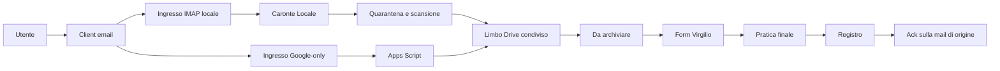

# Architettura Virgilio 1.1

## Scopo e frase guida

Virgilio acquisisce documenti da email, li porta nel **Limbo**, li rende
disponibili in **Da archiviare**, raccoglie una decisione umana e li archivia
nella pratica finale registrando gli eventi nel **Registro**.

La frase architetturale condivisa e`:

> Virgilio ha due ingressi tecnici e un solo flusso operativo.

I due ingressi sono il profilo Google-only basato su GmailApp e il profilo
local-first basato su IMAP. Dopo l'acquisizione convergono sullo stesso Limbo,
sulla stessa coda Da archiviare, sullo stesso form e sullo stesso Registro.

La terminologia della roadmap originale resta valida:

```text
Virgilio = interfaccia, guida, supervisione
Caronte Locale = motore operativo locale multi-casella
Apps Script = adapter Google
SQLite = stato tecnico locale
Bucoliche / Registro = audit cloud umano
```

## Dalla versione 1.0 alla 1.1

La 1.0 era un MVP Google Workspace mono-utente: GmailApp acquisiva dalla
casella dell'account esecutore e Apps Script coordinava il flusso. Rimane
recuperabile nel tag `v1.0`, ma non e` la base da estendere per il
multi-casella.

La 1.1 conserva form, Drive e integrazioni Google, aggiungendo un motore locale
provider-agnostico. Questo risolve il limite di GmailApp senza creare un secondo
prodotto o un secondo archivio.

| Capacita` | 1.0 | 1.1 ufficiale |
| --- | --- | --- |
| Ingresso mail | GmailApp, una casella esecutrice | GmailApp oppure IMAP multi-account |
| Quarantena | Limbo usato anche come area temporanea | quarantena locale distinta dal Limbo |
| Scansione | non uniforme | gate locale prima della consegna |
| Stato tecnico | implicito tra script e fogli | SQLite locale persistente |
| Decisione | form Virgilio | stesso form Virgilio |
| Audit | Bucoliche | unico Registro Bucoliche append-only |
| Completamento mail | contesto Gmail dello script | ack sulla casella IMAP di origine |

## Contesto del sistema



Il diagramma mostra una dipendenza logica, non un trasferimento indiscriminato
di dati. Il connettore locale non invia mai byte, base64 o percorsi locali ad
Apps Script: l'integrazione remota usa soltanto metadati e identificativi
verificati.

## Componenti e responsabilita`

### Virgilio

Virgilio e` il sistema e il linguaggio con cui l'utente prende la decisione
documentale. Non e` sinonimo di Caronte: coordina il percorso fino alla pratica
finale e mantiene leggibile la distinzione tra attesa, lavoro umano e
archiviazione conclusa.

### Caronte Locale

Caronte Locale e` il motore Python della linea local-first. Per ogni account
abilitato:

1. legge la cartella IMAP di ingresso senza alterare involontariamente i
   messaggi;
2. applica regole di inclusione ed esclusione;
3. assegna identita` stabili a mail e allegati;
4. salva gli allegati nella quarantena locale;
5. verifica tipo, dimensione e scansione;
6. persiste stato e tentativi in SQLite;
7. consegna i file ammessi al Limbo tramite lo storage adapter;
8. invia a Google soltanto i metadati necessari alla coda;
9. esegue l'ack IMAP solo dopo le post-condizioni di completamento.

Un errore su una casella non deve impedire il controllo delle altre caselle.

### Apps Script

La sorgente canonica e` `apps_script/src/`. Apps Script rimane l'adapter Google
per:

- acquisizione Google-only tramite GmailApp;
- verifica del Limbo e intake metadata-only;
- gestione tecnica del tab `Virgilio_Inbox`, mostrato come Da archiviare;
- form Virgilio e scelta della pratica;
- spostamento Drive verso la destinazione finale;
- append degli eventi nel Registro;
- notifiche Google/Telegram quando configurate.

Apps Script non viene sostituito da Python e il form non viene riscritto.

### Limbo

Il Limbo e` una sola cartella Drive condivisa. Contiene documenti acquisiti ma
non ancora archiviati. Non e`:

- la quarantena, che resta locale e precedente alla scansione;
- la coda, che e` rappresentata da Da archiviare;
- l'archivio finale della pratica.

Drive Desktop realizza nella 1.1 lo storage adapter locale verso il Limbo. La
sincronizzazione e` asincrona: `copiato localmente` e `visibile nel cloud` sono
condizioni distinte.

### Da archiviare e form

Da archiviare contiene una riga per documento e rappresenta solo lavoro
corrente. Il nome tecnico del tab e` `Virgilio_Inbox`. Il form apre la riga,
propone o raccoglie cliente, sito e pratica e conclude lo spostamento del file.

La mail puo` contenere piu` allegati; viene completata soltanto quando tutti i
documenti correlati risultano archiviati.

### Registro

Il Registro e` l'audit umano condiviso nel tab `bucoliche`. E` append-only e
consente di ricostruire eventi, esiti, errori e conflitti. SQLite non lo
sostituisce: mantiene stato tecnico, tentativi e ripresa locale.

## I due profili operativi

### Profilo Google-only

- ingresso GmailApp;
- una casella alla volta, nel contesto dell'esecutore;
- consegna diretta al Limbo condiviso;
- stesso Da archiviare, form, pratica e Registro;
- adatto a modifiche circoscritte a Google Workspace e Apps Script.

### Profilo Local connector

- ingresso IMAP con uno o piu` `account_alias`;
- lettura read-only iniziale con `BODY.PEEK`;
- quarantena e scan prima del Limbo;
- stato SQLite e retry idempotenti;
- ack sulla stessa casella di origine;
- adatto a piu` provider e al percorso offline collaudabile.

I profili non vanno mescolati all'interno di un task: si identifica prima la
superficie, poi si preserva il contratto comune a valle.

## Flusso completo di un documento

1. **Gesto intenzionale.** L'utente colloca una mail nella cartella o etichetta
   configurata, normalmente `Virgilio/da-traghettare`.
2. **Scoperta.** Il connettore identifica account, mailbox, UIDVALIDITY, UID e
   allegati senza marcare la mail come letta.
3. **Identita`.** Ogni allegato riceve `attachment_id`, fingerprint e SHA-256;
   questi valori rendono riconoscibile un retry.
4. **Quarantena.** I byte restano in una radice locale controllata. Percorsi
   assoluti, traversal e nomi non sicuri vengono respinti.
5. **Gate.** Allowlist, dimensione e scanner determinano se il documento puo`
   diventare `ready_for_caronte`.
6. **Consegna.** Lo storage adapter copia file e manifest nella cartella locale
   sincronizzata del Limbo senza sovrascrivere un contenuto confliggente.
7. **Visibilita` cloud.** Un controllo read-only verifica file, manifest,
   SHA-256 e identificativi Drive. La verifica puo` richiedere retry limitati.
8. **Intake.** Apps Script riceve metadati e crea una sola riga attiva in Da
   archiviare; non riceve byte o path locali.
9. **Decisione umana.** Il form associa il documento a cliente, sito e pratica.
10. **Archiviazione.** Apps Script sposta il file dal Limbo alla cartella finale
    e marca la riga `archiviato`.
11. **Audit.** Il Registro riceve la transizione leggibile e le correlazioni
    tecniche indispensabili.
12. **Completamento mail.** Solo quando tutti gli allegati ammessi sono conclusi
    Caronte applica la strategia ack, verifica la post-condizione e rimuove la
    sola etichetta di ingresso. Non usa `DELETE`, `MOVE` o `EXPUNGE`.

## Struttura del software locale

```text
user_app -----------+
maintenance_gui ----+--> application services --> dominio / porte --> adapter
CLI (__main__) ------+
```

| Livello | Percorsi principali | Regola |
| --- | --- | --- |
| Presentazione utente | `user_app/` | linguaggio operativo, nessun dettaglio macchina inutile |
| Presentazione manutenzione | `maintenance_gui.py` | diagnosi, integrita`, backup e reset controllato |
| CLI | `__main__.py`, `cli.py` | parsing, output e codici di ritorno |
| Servizi applicativi | `application/` | casi d'uso condivisi dalle tre superfici |
| Dominio e contratti | `models.py`, `state_models.py`, `contract.py`, `ports.py` | invarianti e tipi senza dipendenza dalla GUI |
| Adapter | `imap_readonly.py`, `state_db.py`, `staging_transport.py`, `bucoliche.py` | accessi concreti e sostituibili |

Le tre presentazioni non duplicano la logica operativa. `user_app` e
`maintenance_gui` non devono importare l'implementazione GUI legacy `gui` o
`gui_*`.

## Topologia e dati locali

Sul PC Windows vivono l'applicazione Caronte, la configurazione YAML, le
credenziali protette, la quarantena e `state.db`. Google Drive per desktop
sincronizza una cartella locale con il solo Limbo cloud. Nel perimetro Google
vivono Apps Script, Drive, Da archiviare, form e Registro.

Questa topologia implica tre responsabilita` operative:

- proteggere e sottoporre a backup configurazione, credenziali e stato locale;
- non interpretare la copia locale come prova immediata di visibilita` cloud;
- mantenere allineati deployment Apps Script e contratto metadata-only.

## Invarianti da preservare

- un solo Limbo, una sola coda Da archiviare e un solo Registro;
- una riga Da archiviare per documento, non per mail;
- niente falso completamento dopo un errore parziale;
- ack IMAP soltanto dopo archiviazione e audit verificati;
- nessun byte, base64 o percorso locale inviato ad Apps Script;
- credenziali e dati operativi fuori da Git;
- form e sorgente Apps Script canonica preservati;
- GUI e CLI sopra gli stessi servizi applicativi;
- notifiche non bloccanti e mai fonte primaria di stato;
- AI, RAG, database remoti e server web fuori dalla release 1.1.

## Estensioni previste dall'architettura

Storage e notifiche sono adapter. Un futuro adapter puo` essere introdotto solo
se mantiene identita`, idempotenza, post-condizioni e test offline. Non basta
aggiungere un pulsante o un comando: il caso d'uso deve restare condiviso e la
UX deve usare il lessico dell'utente.

Le evoluzioni dopo la 1.1 sono riepilogate nella
[roadmap](../sviluppo/ROADMAP_1_1.md); non sono funzionalita` gia` promesse.

## Glossario

| Termine | Significato corrente |
| --- | --- |
| Virgilio | sistema di guida, decisione e supervisione documentale |
| Caronte | applicazione desktop per il lavoro ordinario |
| Caronte Manutenzione | applicazione separata per operazioni tecniche |
| Caronte Locale | motore locale multi-casella e provider-agnostico |
| Quarantena | area locale controllata prima della scansione |
| Limbo | unica cartella Drive dei documenti acquisiti non archiviati |
| Da archiviare | coda umana corrente; nome tecnico `Virgilio_Inbox` |
| Form | interfaccia che raccoglie la decisione sulla pratica |
| Pratica finale | cartella documentale definitiva, normalmente sotto `02_corrispondenza` |
| Registro | audit cloud umano append-only nel tab `bucoliche` |
| SQLite | stato tecnico locale, non visibile nell'uso ordinario |
| Manifest | metadati tecnici del file, non il documento stesso |
| Fingerprint | correlazione stabile usata per deduplicazione e diagnosi |
| Ack IMAP | completamento verificato sulla casella mail di origine |
