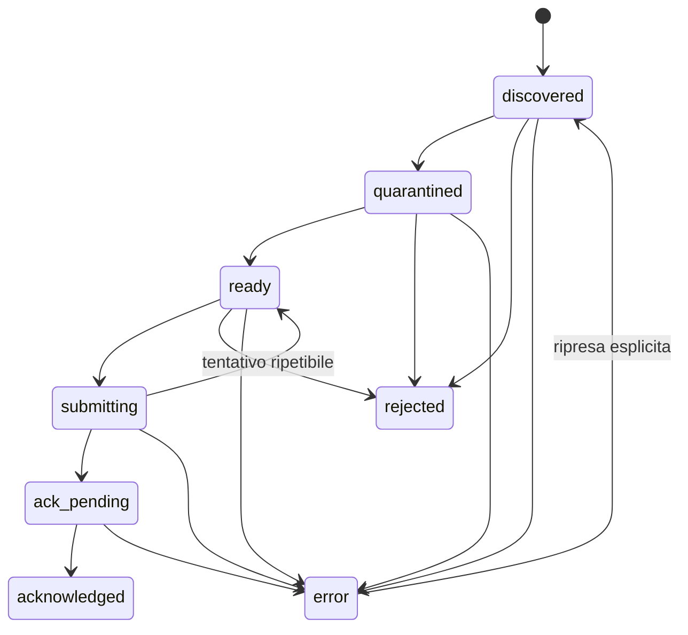

# Modello dati, identita` e stati

## Perche` esistono piu` rappresentazioni

Virgilio segue la stessa operazione attraverso sistemi diversi. Nessuna singola
riga sostituisce le altre:

| Rappresentazione | Dove vive | A cosa serve |
| --- | --- | --- |
| messaggio e allegato IMAP | casella di origine | sorgente e post-condizione dell'ack |
| record SQLite | PC locale | stato tecnico, tentativi, retry e ripresa |
| file e manifest | quarantena / Limbo | contenuto controllato e correlazioni |
| riga Da archiviare | Google Sheet `Virgilio_Inbox` | decisione umana corrente |
| evento Registro | Google Sheet `bucoliche` | audit storico leggibile |

La coerenza nasce da identita` stabili e transizioni verificate, non dalla
duplicazione indiscriminata di tutti i dati.

## Identita` principali

### Messaggio

La chiave tecnica IMAP e` la combinazione:

```text
account_alias + mailbox + mailbox_uidvalidity + message_uid
```

`message_id` e `thread_id` aiutano la correlazione, ma non sostituiscono la
chiave IMAP: possono essere assenti, duplicati o dipendere dal provider.

### Allegato

- `local_temp_id`: identificativo opaco interno al comando;
- `attachment_id`: identificativo stabile propagato nella consegna;
- `sha256`: digest del contenuto, sempre 64 caratteri esadecimali minuscoli;
- `fingerprint`: correlazione tra provenienza e documento;
- `original_filename`: nome ricevuto, conservato come metadato;
- `sanitized_filename` / `staged_filename`: nome sicuro usato nei percorsi
  controllati.

L'hash da solo non descrive la provenienza. Due documenti uguali possono essere
allegati a mail diverse; identita` e deduplicazione tengono quindi conto anche
di account e messaggio.

### Comando Caronte

Il contratto `schema_version = 1.0` descrive una richiesta di consegna. Include
`command_id`, account, mailbox, UID, metadati della mail, allegati, stato di
quarantena e flag `dry_run`. Un comando operativo richiede
`user_confirmed_command = true` e accetta soltanto allegati
`ready_for_caronte`.

La risposta distingue allegati accettati e respinti, identificativi Drive,
riferimenti Registro ed errori retryable. I campi sconosciuti sono rifiutati:
il contratto non e` un contenitore aperto.

## Stato SQLite

La release contiene persistenza locale per stato tecnico e migrazioni additive.
Le tabelle principali sono:

| Tabella | Contenuto | Vincolo rilevante |
| --- | --- | --- |
| `messages` | provenienza IMAP e stato della mail | unicita` della chiave IMAP per account |
| `attachments` | identita`, hash, quarantena, scan e consegna | SHA-256 valido; percorsi relativi controllati |
| `command_attempts` | tentativi di invio e risposta | numero tentativo e digest della richiesta |
| `state_events` | transizioni tecniche | stato precedente, nuovo stato, ragione e timestamp |

`state.db` non conserva i byte degli allegati, segreti o token. La quarantena
rimane nel filesystem e le credenziali nel deposito protetto previsto.

### Stati del messaggio



- `discovered`: mail riconosciuta;
- `quarantined`: allegati salvati sotto controllo;
- `ready`: gate locali superati;
- `submitting`: consegna in corso;
- `ack_pending`: consegna accettata, manca la post-condizione mail;
- `acknowledged`: completamento IMAP verificato;
- `rejected`: esito terminale per policy;
- `error`: errore tecnico riprendibile soltanto tramite la transizione prevista.

### Stati dell'allegato nel contratto

| Stato | Significato |
| --- | --- |
| `downloaded` | byte acquisiti ma non ancora isolati |
| `quarantined` | file nella radice controllata |
| `rejected` | policy non superata |
| `scan_failed` | scansione non conclusa in modo affidabile |
| `ready_for_caronte` | file ammesso alla consegna |
| `uploaded_to_limbo` | file consegnato al Limbo |

Il percorso operativo locale usa stati piu` dettagliati, per esempio
`rejected_by_extension`, `rejected_by_size`, `quarantined_unverified`,
`rejected_by_scanner`, `staged_local_drive`, `staged_storage`,
`staging_failed` e `staging_conflict`. Sono dettagli diagnostici, non termini da
mostrare nella GUI utente.

### Tentativi

Un tentativo e` `pending`, `succeeded` o `failed`. Il digest della richiesta
permette di riconoscere una ripetizione non equivalente. Gli errori distinguono
la possibilita` di retry: un timeout o la mancata visibilita` Drive possono
essere temporanei; un hash discordante o un conflitto di destinazione richiedono
intervento.

## Manifest di staging

Il manifest JSON accompagna il file nel percorso locale e contiene almeno:

- `attachment_id`;
- `staged_filename`;
- `sha256`;
- `size_bytes`.

Puo` includere account, provenienza, timestamp e metadati aggiuntivi previsti
dal contratto. Un manifest non contiene credenziali e non autorizza da solo
l'intake. La verifica cloud richiede che:

1. file e manifest siano presenti;
2. i campi coincidano con la richiesta locale;
3. gli ID Drive siano opachi, non percorsi;
4. `cloud_visible` sia vero soltanto quando tutte le verifiche precedenti sono
   vere.

## Da archiviare

Il tab tecnico `Virgilio_Inbox` e` mostrato all'utente come Da archiviare. Ha
una riga per documento nel Limbo e una sola riga attiva per `fingerprint` o, in
assenza, `attachment_id`.

| Gruppo | Campi rappresentativi | Uso |
| --- | --- | --- |
| Identita` riga | `inbox_id`, `created_at`, `status` | ciclo della decisione umana |
| Identita` tecnica | `fingerprint`, `attachment_id`, `sha256` | idempotenza e diagnosi |
| Drive | `drive_file_id`, `manifest_file_id` | oggetti verificati nel Limbo |
| Provenienza | `account_alias`, `source_email`, `source_message_id`, `source_message_uid` | correlazione con la casella |
| Documento | `original_filename`, `staged_filename` | riconoscimento controllato |
| Suggerimenti | `suggested_cliente`, `suggested_sito`, `suggested_pratica`, `form_url` | aiuto alla decisione |
| Note | `notes` | metadati compatti `chiave=valore`, non secondo audit |

Il ciclo normale e`:

```text
da_lavorare -> in_lavorazione -> archiviato
```

Da archiviare non conserva la storia completa: dopo l'archiviazione il Registro
rimane la fonte di audit.

## Registro Bucoliche

Il tab canonico `bucoliche` usa lo schema umano a 17 colonne:

1. `timestamp`;
2. `origine`;
3. `cliente`;
4. `sito`;
5. `pratica`;
6. `anno`;
7. `tecnici`;
8. `note`;
9. `url_cartella`;
10. `id_drive`;
11. `mittente_dominio`;
12. `oggetto_email`;
13. `nome_file`;
14. `estensione`;
15. `dimensione_kb`;
16. `stato`;
17. `timestamp_archiviazione`.

La privacy limita i dati di provenienza quando possibile, per esempio usando il
dominio del mittente invece dell'indirizzo cliente completo. Errori e conflitti
sono eventi dello stesso Registro, con correlazioni tecniche nelle note; non si
creano tab produttivi paralleli `Bucoliche_Eventi`, `Bucoliche_Stato` o
`Bucoliche_Conflitti`.

L'append al Registro e` deduplicato sulla chiave evento prevista. La notifica
puo` fallire senza cambiare lo stato primario; la politica sull'errore Registro
dipende invece dalla post-condizione del flusso che sta completando.

## Idempotenza end-to-end

| Confine | Protezione |
| --- | --- |
| scansione IMAP | chiave account/mailbox/UIDVALIDITY/UID |
| quarantena | identita` allegato, SHA-256 e percorso relativo |
| comando | `command_id`, numero tentativo e digest richiesta |
| staging | nessuna sovrascrittura silenziosa; hash e manifest |
| visibilita` Drive | ID opachi e verifica file/manifest |
| Da archiviare | unicita` della riga attiva per identita` tecnica |
| Registro | append unico dell'evento equivalente |
| ack | verifica della post-condizione sulla casella di origine |

Un retry deve proseguire dal primo stato non confermato. Non deve ricreare
righe, sovrascrivere file diversi o segnare la mail come conclusa in anticipo.

## Timestamp e dati sensibili

Gli eventi operativi sono rappresentati in `Europe/Rome`; i contratti di rete
richiedono timestamp ISO 8601 con fuso. Log e report diagnostici devono oscurare
segreti e limitare oggetto, mittente e percorsi ai dati necessari alla diagnosi.

Per configurazione e posizione dei dati consulta
[Configurazione e integrazioni](CONFIGURAZIONE_E_INTEGRAZIONI.md); per backup e
recupero consulta [Operazioni e manutenzione](OPERAZIONI_E_MANUTENZIONE.md).
